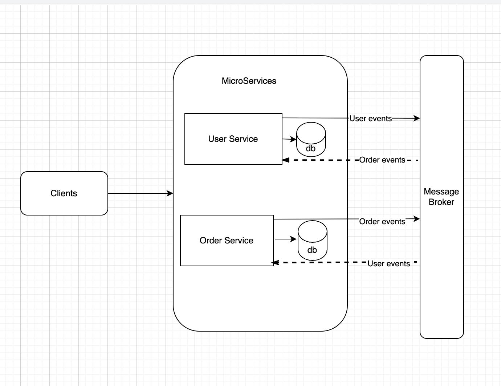

# Microservices architecture for ECommerce .Net Core Application
### .Net Core 10.0 using asp.net core Web API with C#.Net and EF
- [Microservices architecture for ECommerce .Net Core Application](#microservices-architecture-for-ecommerce-net-core-application)
    - [.Net Core 10.0 using asp.net core Web API with C#.Net and EF](#net-core-100-using-aspnet-core-web-api-with-cnet-and-ef)
  - [Introduction](#introduction)
  - [Application Architecture](#application-architecture)
    - [Resiliency Improvements](#resiliency-improvements)
    - [Middlewares Used](#middlewares-used)
    - [End-points for UserSerice API](#end-points-for-userserice-api)
    - [End-points for Orderservice API](#end-points-for-orderservice-api)
  - [Opensource Tools Used](#opensource-tools-used)
  - [How to run the application](#how-to-run-the-application)
    - [Docker Compose](#docker-compose)
    - [Local Development](#local-development)
    - [Swagger UI](#swagger-ui)
## Introduction
This is a .Net Core application implementing a microservices based back-end system for a simple ECommerce system showcasing features like user/order creation and demonstrating cross-service communication in ASP.NET Core Web API with C#.Net and Entity Framework. 

## Application Architecture

The sample application is build based on the microservices architecture. There are serveral advantages in building a application using Microservices architecture like Services can be developed, deployed and scaled independently.The below diagram shows the high level design of Back-end architecture.


### Resiliency Improvements
The OrderService has been designed with resilience to infrastructure failures in mind. When creating an order, the service validates user existence through a three-tier approach: first checking a local cache populated by Kafka events, then making a direct HTTP call to UserService, and finally allowing order creation . This design ensures that temporary failures in message brokers do not block critical business operations, while centralized exception handling and correlation IDs provide observability for troubleshooting distributed issues across microservices.

### Middlewares Used
- ExceptionHandlingMiddleware (Centralized exception handling with JSON error responses and appropriate HTTP status codes)
- CorrelationIdMiddleware (Distributed tracing support by injecting correlation IDs across service calls for request tracking)

### End-points for UserSerice API

1. Route: **"/api/user"** [HttpPost]- To create a new user
2. Route: **"/api/user/{id}"** [HttpGet]- To get user details by user id

### End-points for Orderservice API

1. Route: **"/api/order"** [HttpPost]- To create a new order
2. Route: **"/api/order/{id}"** [HttpGet]- To get order details by order id

## Opensource Tools Used
- Serilog (For Logging)
- Automapper (For object-to-object mapping)
- Entity Framework Core (For Data Access)
- Kafka (Message Broker)
- Swashbucke (For API Documentation)
- XUnit (For Unit test case)


## How to run the application

1. Clone the repository to your local machine
2. Open the solution in Visual Studio or Visual Studio Code

### Docker Compose
```bash
docker compose down --volumes 
docker compose build --no-cache
docker compose up
```

### Local Development
```bash
cd UserService
dotnet run --urls=http://localhost:5001
cd OrderService
dotnet run --urls=http://localhost:5002

```

### Swagger UI
 Swagger Middleware configured in the startup.cs for API documentation. when running the WebApi service, the swagger UI can be accessed through the swagger endpoint "/swagger".

1. User Service Swagger URL: 
   http://localhost:5001/swagger/index.html
2. Order Service Swagger URL: 
   http://localhost:5002/swagger/index.html